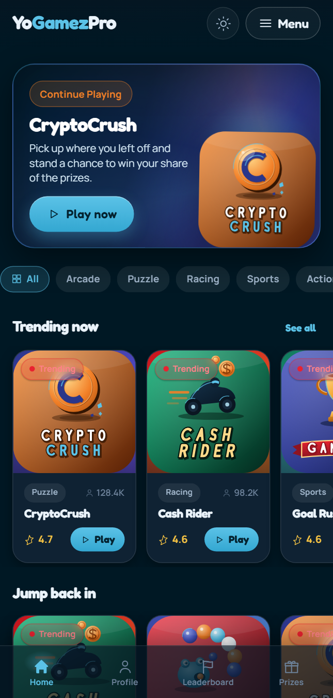
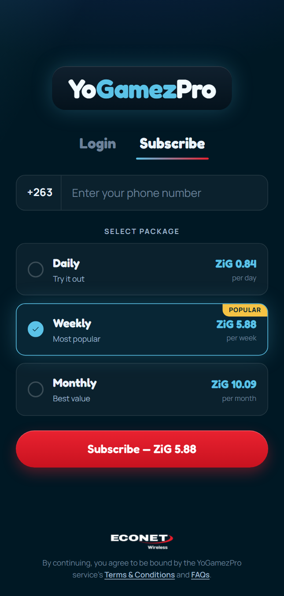
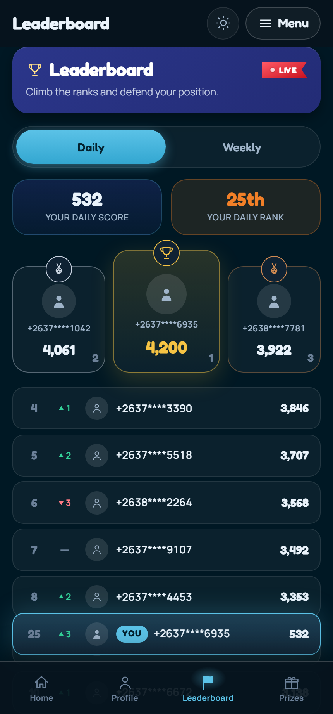
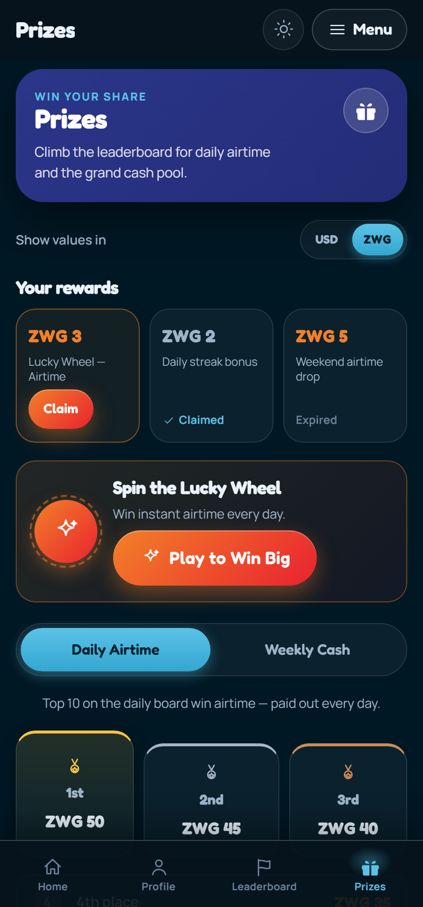
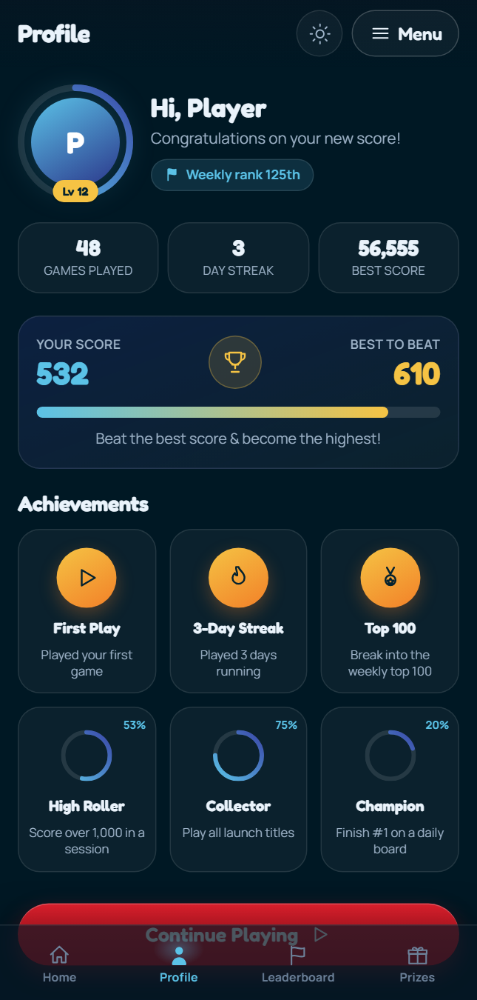
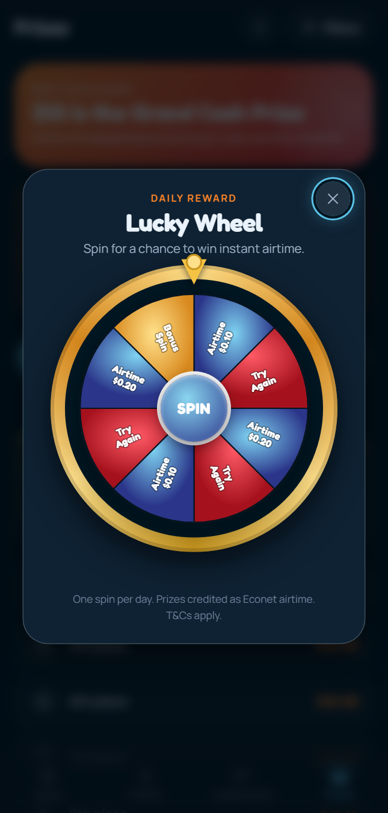

# YoGamezPro 2.0

A premium UI/UX rebuild of Econet Wireless Zimbabwe's HTML5 mobile-gaming subscription platform (VAS) — dark-canvas-first, fully themed, and rebuilt on a modern React + TypeScript + Vite stack while preserving every piece of the production business logic.


Live: <https://yogamezpro.vercel.app> &nbsp;·&nbsp; Repository: <https://github.com/vhurudzaicomfort-byte/yogamezpro>

---

## Screenshots

| | |
|---|---|
| <br/>**Home** — hero banner, snap-scroll rails and the game grid on the dark gaming canvas. | <br/>**Subscribe** — the three ZiG plans with the recommended tier highlighted. |
| <br/>**Leaderboard** — Daily / Weekly segmented boards with the player's rank pinned. | <br/>**Prizes** — daily airtime and weekly cash prize ladders. |
| <br/>**Profile** — player stats, achievements and progress rings. | <br/>**Lucky Wheel** — service-decided daily reward spin with an accessible dialog. |

---

## Overview

YoGamezPro is Econet Wireless Zimbabwe's premium HTML5 mobile-gaming VAS. Subscribers get unlimited instant-play access to a catalogue of casual/arcade titles, compete on Daily and Weekly leaderboards, earn airtime and cash prizes, and are onboarded through Econet's MSISDN + OTP subscription flow. Billing is in **ZiG (Zimbabwe Gold)** and the dialing code is **+263**.

Version 2.0 is a full design-and-engineering rebuild. It inverts the old light "sunburst" canvas into a dark, brand-led gaming surface (with a fully supported light theme), replaces icon fonts and rasters with a single custom vector system, and rebuilds every screen as a token-driven React component — while preserving the exact prices, prize ladders, leaderboards, auth journey and destinations of the production portal. The rebuild is documented against a pre-code audit of the original screens (see [`documentation/AUDIT.md`](documentation/AUDIT.md)).

## Features

- **Dark-canvas-first design** with a complete light theme, toggled at runtime via the `data-theme` attribute on `<html>` and persisted to `localStorage`.
- **MSISDN + OTP authentication** — E.164 number entry with the `+263` prefix, a 4-digit PIN with segmented OTP entry (paste-to-fill, autofill, keyboard nav) and a 60-second resend window.
- **Three ZiG subscription plans** — Daily, Weekly and Monthly, prices preserved exactly from production.
- **Daily & Weekly leaderboards** with the player's own rank pinned, plus an achievements wall.
- **Prize ladders** — daily airtime and weekly cash top-10 tables.
- **Lucky Wheel daily reward** — outcome decided by the prize service *first*, animation targeted to it; frequency-capped (once per day), reduced-motion aware, and rendered as an accessible dialog.
- **Custom SVG icon system** — one 24px grid with line/solid pairs, plus upgraded per-title game vector art. No icon fonts, no emoji.
- **Accessible by construction** — focus trapping, `aria-live` announcements, visible focus rings, a skip link, WCAG AA contrast and a global `prefers-reduced-motion` kill-switch.
- **Performance-minded** — route-level code splitting, skeletons sized for zero layout shift, and a small initial bundle (~125 KB gzip, budget < 200 KB).

## Tech stack

| Concern | Choice |
|---|---|
| Build tool | Vite 8 |
| UI runtime | React 19 |
| Language | TypeScript 6 |
| Routing | React Router v7 (`BrowserRouter` in `src/main.tsx`, `Routes` in `src/App.tsx`) |
| Animation | Framer Motion 12 |
| Styling | CSS Modules + CSS custom-property design tokens (no UI library) |
| Fonts | Fontsource — Fredoka Variable (display) + Manrope Variable (UI) |
| Linting | Oxlint |
| Hosting | Vercel (SPA rewrites via `vercel.json`) |

## Getting started

Requires **Node 20+** (Vite 8 baseline).

```bash
npm install      # install dependencies
npm run dev      # start the Vite dev server with HMR
npm run build    # type-check (tsc -b) and build for production
npm run preview  # preview the production build locally
npm run lint     # run Oxlint
```

## Project structure

```
src/
├── main.tsx                 App entry — mounts providers (Theme, Session, Toast, Wheel) + BrowserRouter
├── App.tsx                  Route table with route-level lazy loading (Suspense)
├── components/
│   ├── ui/                  Primitive UI kit — Button, Input, Card, Chip, Skeleton, Modal, etc.
│   ├── game/                Game presentation — GameCard (5 variants), GameRail, GameGrid, HeroBanner
│   ├── wheel/               Lucky Wheel — LuckyWheel, Confetti, SVG geometry/landing math
│   └── layout/              App chrome — Header, BottomNav, SideMenu, Wordmark, loaders, logos, AuthTabs
├── layouts/                 Page shells — AppLayout (authenticated) and AuthScreen (pre-auth)
├── pages/                   Route screens — Home, Subscribe, Login, Otp, Leaderboard, Prizes, Profile, etc.
├── hooks/                   React context providers — useTheme, useToast, useSession, useWheel
├── icons/                   Custom SVG icon system (Icon) + per-title game art (games/GameIcon)
├── animations/             Shared Framer Motion variants + motion tokens mirrored from CSS
├── styles/                  globals.css + design tokens (tokens.css) + semantic themes (themes.css)
├── services/                Mock backend — authService (MSISDN/OTP), prizeService (wheel outcome)
├── config/                  Static data — catalogue (games/plans/prizes), leaderboard, wheel segments
├── types/                   Shared domain TypeScript types
├── utils/                   Helpers — msisdn (E.164), format (play counts)
└── assets/                  SVG art — Econet logos + game icons
```

## Architecture & decisions

- **Dark-canvas-first.** Dark is the default gaming surface; light is a fully-supported theme. `useTheme` stamps `data-theme` on `<html>`, defaulting to dark and persisting the choice.
- **Semantic tokens, two themes.** `styles/tokens.css` holds brand *primitives* (raw hex) that components never touch. `styles/themes.css` maps them to *semantic* tokens (`--bg`, `--text`, `--brand`, …) for both dark and light. Components consume semantic tokens only — never raw hex.
- **Mock services shaped to swap for a real backend.** `authService` mirrors the real header-enrichment / OTP endpoints, and `prizeService` mirrors the prize-draw contract, so a live API drops in behind the same call signatures. Critically, the **Lucky Wheel outcome is decided by the service first** and the animation is only *targeted* at the returned segment — the spin never chooses the prize.
- **Accessibility.** Focus trapping and Escape-to-close in the `Modal`/`SideMenu`, `aria-live` prize and toast announcements, WCAG AA contrast (see the [style guide](documentation/STYLE_GUIDE.md)), visible focus rings, a skip link, and a global `prefers-reduced-motion` kill-switch that also disables the wheel spin.
- **Performance.** Route-level code splitting keeps the auth entry eager and lazy-loads the rest; the initial bundle is ~125 KB gzip against a < 200 KB budget. Skeletons are sized to their final content for zero cumulative layout shift, and all hover/press motion is transform/opacity only (GPU-composited).

## Business logic preserved

| Domain | Preserved detail |
|---|---|
| Currency & dial code | ZiG (Zimbabwe Gold); `+263` |
| Auth | MSISDN + OTP; 4-digit PIN; 60-second resend window |
| Plans | Daily **ZiG 0.84**/day · Weekly **ZiG 5.88**/week · Monthly **ZiG 10.09**/month |
| Leaderboards | Daily and Weekly boards; player rank pinned |
| Daily prizes | Airtime ladder, ranks 1–10 (50, 45, … 5) |
| Weekly prizes | Cash ladder, ranks 1–10 (500, 450, … 100, 50) |
| Navigation | 4-tab bottom nav (Home · Profile · Leaderboard · Prizes) + side drawer (adds Ts & Cs, FAQ, Unsubscribe) |
| Launch games | CryptoCrush, Cash Rider, Zuma, Gamewin (each with rebuilt vector art) |

## Documentation

- [`documentation/AUDIT.md`](documentation/AUDIT.md) — pre-code audit of the original production screens and the logic to preserve.
- [`documentation/STYLE_GUIDE.md`](documentation/STYLE_GUIDE.md) — the design system: tokens, themes, WCAG AA contrast table, typography, spacing and motion.
- [`documentation/ICON_SPEC.md`](documentation/ICON_SPEC.md) — the icon specification for both the UI icon system and the game art.
- [`documentation/COMPONENTS.md`](documentation/COMPONENTS.md) — component and hook API reference.

## Deployment

Deployed to **Vercel** as a single-page app. `vercel.json` rewrites all non-asset paths to `/index.html` so client-side routing works on deep links, and fingerprinted assets are served with a one-year immutable cache. Live at <https://yogamezpro.vercel.app>.

## Credits

Product and brand: **Econet Wireless Zimbabwe** (YoGamezPro VAS). Game icons are the supplied, upgraded vector art rebuilt from the original logo kit. This repository is a UI/UX rebuild; all business logic, prices and prize structures are preserved from the production portal.
